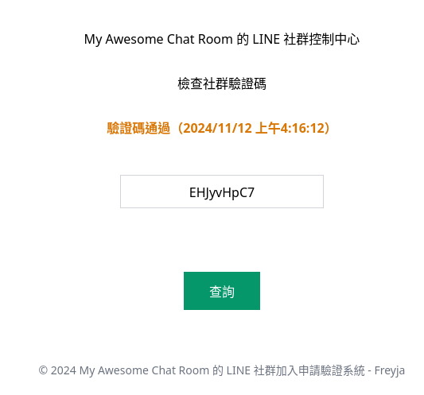

# Freyja

> The best friend of LINE OpenChat.

LINE 社群加入申請驗證系統。

## 功能特色

可快速建立 LINE 社群加入申請驗證系統，並提供 Google reCAPTCHA 驗證。

用於簡易驗證 LINE 社群加入申請者是否為正常人類。

- Google reCAPTCHA 驗證
- 申請時間紀錄
- 低硬體需求

## 螢幕截圖




## 系統設定

### 安裝相依套件

本專案使用 Node.js 作為開發環境，請先安裝 Node.js。

該指令會安裝專案所需的相依套件。

```sh
npm install
```

### 開發除錯模式

本專案採用 Nodemon 作為開發除錯工具。

該指令會啟動伺服器，並在程式碼變更時自動重啟伺服器。

```sh
npm run dev
```

### 正式產品模式

該指令會啟動伺服器。

```sh
npm start
```

## 開放原始碼授權

本專案採用 MIT 開放原始碼授權。

詳細可參閱 [LICENSE](LICENSE) 檔案。

---

&copy; [Taiwan Web Technology Promotion Organization](https://web-tech.tw)
